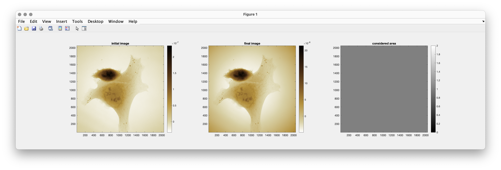
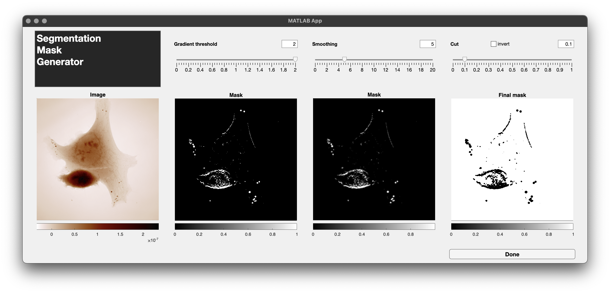
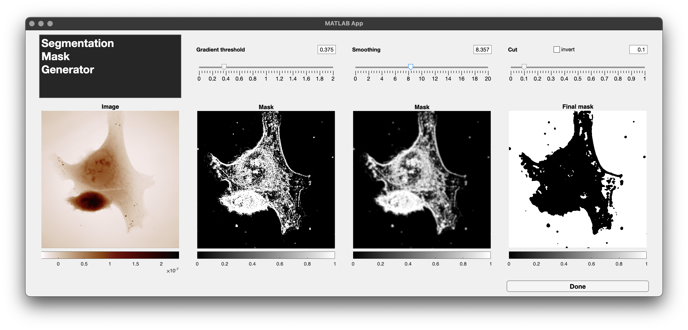
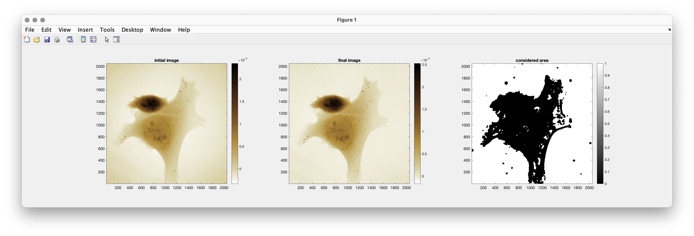

.. _Background_Flattening:

OPD background Flattening
+++++++++++++++++++++++++

Background distorsions in CGM
-----------------------------

Even if a proper reference image is acquired and used, a non-uniform background can distort the image. It usually happens if the delay between the reference image and the object image is too long (typically more than several minutes). It is due to setup relaxation. It is typically the sign that a new reference should be acquired. However, it is not always possible, for instance when acquiring movies. Non-uniform background can be easily corrected a posteriori. These distorsions are always smooth, corresponding to low image frequencies.

The typical approach to remove unwanted low-frequency distorsions is the **computation of image moments**, and their subtraction to the image.

The :ref:`flatten <The_flatten_method>` method of the |ImageQLSI| and |ImageEM| classes handles this task. Here is the prototype: :matlab:`flatten(method, options)`. The ``method`` parameters tells which polynomials are used for the computation of the moments.

In particular, this method corrects the background of the OPD image using image segmentation, so that the object is removed from the computation and only the background pixels are considered. This segmentation algorithm involves 3 parameters. One can let the default values, which usually work fine for eukaryotic cells, or open an app that help setting them by observing the effect in real time on the segmentation.

Here are the details on how to use the background flattening tools.

Simple OPD background correction
--------------------------------

Here is the simplest code to correct a coma aberration on an image:

.. code-block:: matlab

    %% An IM object was created before
    IM.flatten("Legendre","nmax",2);

One can also save the modified image in another object:

.. code-block:: matlab

    %% An IM object was created before
    IMf = IM.flatten("Legendre","nmax",2);

In this case, the *Legendre* :math:`(n,m)` moments of the image are calculated, up to :math:`n+m=2`, and the corresponding images are subtracted.

Here is the figure that pops up:

The first image is the initial OPD. It exhibits a slight coma aberration (the corners are dark). The second one is the corrected image. One can see that the flattening does not work properly in this case. The corner are even darker. It is because the moments have been calculted over the full image, including the cell. The following section explains how to use the :ref:`flatten <The_flatten_method>` function in a refined manner.

Object segmentation and removal before correction
-------------------------------------------------

The problem with the previous approach is that the object of interest can markedly affect the computation of the moment, while it should not. The simple algorithm works for bacteria for instance, i.e., small objects scattered thoughout the field of view, but much less for eukaryotic cells, i.e. large and thick objects. In this case, the objects need to be removed numerically before calculating the moments. This step requires a segmentation procedure. |PhaseLAB| uses a segmentation algorithm based on the processing of the gradients of the images. There are three steps:

* the selection of the area of the image where the gradients exceed a certain threshold (``threshold`` parameter).
* a smoothing of the resulting mask (``smoothing`` parameter)
* a thresholding of the image to get a boolean mask (``cut`` parameter)

To help determine these parameters, the  ``segmentationMaskGen`` function can be used:

.. code-block:: matlab

    [mask, paramsOut] = segmentationMaskGen(img)
    [mask, paramsOut] = segmentationMaskGen(img, paramsIn)

``img`` can be either an image, or an |ImageQLSI| object. If an |ImageQLSI| object, then the OPD image is considered.
It launches a Matlab App composed of 4 images:

The first image is the initial image, the 2nd one is the mask after application of the Gradient threshold, the 3rd is after the smoothing and the 4th is the final boolean mask after application of the ``cut`` parameter.

Each of these three parameters can be adjusted with the corresponding sliders, and the effect is observed in real time.

Note the *invert* option. For live cells, the objects to segment usually feature a positive OPD. But in some cases, it can be the opposite. To segment negative-value objects, the invert option can be ticked.

Once the set of parameters is satisfying, they can be exported by pressing the *Done* button. The corresponding mask and the parameters are returned in the ``mask`` and ``paramsOut`` outputs. ``paramsOut`` is a structure that contains the three parameters in the following fields: ``gradThresh``, ``smoothing``, ``cut``.

Also, a preset of parameters can be specifying as a second input ``paramsIn``.

Once these parameters are determined, they can be injected as input parameters of the function :ref:`flatten <The_flatten_method>`. There are two options. Either the mask is specified, or the three parameters:

.. code-block:: matlab
    :linenos:

    [mask, paramsOut] = segmentationMaskGen(IM(1))

    IMf = IM.flatten("Legendre","nmax",2,"mask",mask);
    % or
    IMf = IM.flatten("Legendre","nmax",2,"params",paramsOut);
    % or
    IMf = IM.flatten("Legendre","nmax",2,"threshold",1,"nGauss",10,"cut",0.5,"invert",false);

Here are the two figures that successively show up with this code.

In the middle figure, one can see the improvement of the background correction.

``IM`` can be for instance an array of |ImageQLSI| objects. In that case, the same mask, or parameters, determined from the first object, will be applied to all the images. The first solution (line 3) is ok if the object does not move all along the images. The second and third solutions (lines 5 or 7) are appropriate, for instance, for motile cells. In that case, it is probable that the set of parameters determined from the first image will be appropriate for the rest of the movie.

